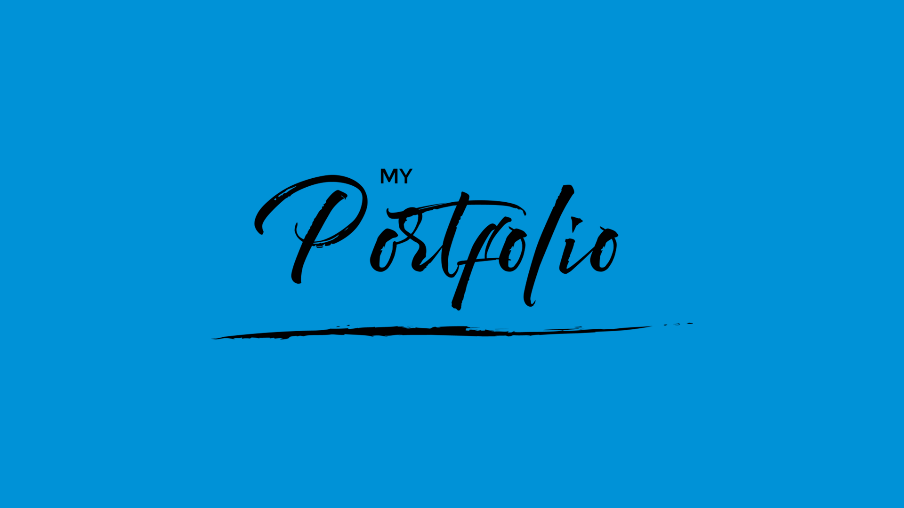

<h1 align="center">Portfólio </h1>  

    

  Bem-vindo ao meu Portfólio. Aqui, você encontrará minha jornada e projetos incríveis. 🚀 Vamos explorar!

## Índice

- [Introdução](#introdução)
- [Visualização do projeto](#Visualização-do-projeto)
  - [Link deploy]()
- [Objetivos](#Objetivos)
- [Tecnologias usadas](Tecnologias-usadas)
- [Contato e Feedback](#contato-e-feedback)
- [Agradecimentos](#Agradecimentos)

## Introdução

Olá e seja bem-vindo ao meu repositório do portfólio! Neste espaço, compartilho minha jornada no desenvolvimento web e reúno os frutos do meu trabalho. Cada projeto aqui representa uma oportunidade de aprendizado e crescimento, à medida que continuo a explorar novas tecnologias e aprimorar minhas habilidades.

Fico entusiasmado em abrir as portas do meu portfólio para que você possa explorar, fornecer feedback ou até mesmo colaborar. Este repositório é o resultado de minha dedicação ao desenvolvimento web, e estou animado em compartilhá-lo com a comunidade. Agradeço por sua visita e por fazer parte desta jornada!

## Visualização do projeto

  <a href="https://robson-jorge.github.io/Portfolio/" onclick="window.open(this.href, '_blank'); return false;">Link deploy
  </a>
    
  
Desktop

  
  
Mobile

  

## Objetivos

Meu projeto de portfólio tem como objetivo central destacar minhas habilidades como desenvolvedor web frontend e mostrar uma coleção de projetos nos quais trabalhei. Quero compartilhar minha paixão pelo desenvolvimento web e criar conexões na comunidade de tecnologia. Além disso, o portfólio serve como um espaço para contato, facilitando a comunicação com colegas, possíveis colaboradores e entusiastas de tecnologia.

## Tecnologias usadas

- HTML - usada para estruturar a página
- CSS - estilizar elementos da página
- JavaScript - adiciona interações com os elementos

## Contato e Feedback

Adoraríamos ouvir a sua opinião e valorizamos o feedback da comunidade. Estamos comprometidos em melhorar continuamente nosso projeto e sua contribuição é fundamental.

### Fale Conosco

Se você tiver alguma pergunta, sugestão ou apenas desejar entrar em contato, estamos à disposição. Você pode nos encontrar nas seguintes plataformas:

- [LinkedIn](https://www.linkedin.com/in/robson-jorge-62a12a26a/)
- Email: [robsonsouzajorge@hotmail.com](mailto:robsonsouzajorge@hotmail.com)
- WhatsApp: [+55 62 99260-0017](https://api.whatsapp.com/send/?phone=%2B556292600017&text&type=phone_number&app_absent=0)

### Sua Opinião Importa

Se você explorou nosso projeto e tem alguma observação, sugestão ou apenas deseja entrar em contato, por favor, compartilhe conosco. Valorizamos seu feedback e estamos constantemente buscando maneiras de melhorar. Seu insight é valioso e ajuda a aprimorar nosso projeto. Não hesite em nos contatar, mesmo que seja apenas para dizer "oi." Aguardamos ansiosamente seu contato e agradecemos sua participação em nossa jornada.

## Agradecimentos

Quero expressar minha sincera gratidão à equipe "Dev em Dobro" por sua inestimável contribuição ao meu crescimento como desenvolvedor web frontend. O curso proporcionou uma base sólida de conhecimento e ferramentas, que foram essenciais na criação deste portfólio. Sua didática excepcional e o valioso conteúdo do curso desempenharam um papel fundamental na minha evolução profissional. Se você também busca oportunidades de aprendizado e crescimento na área de tecnologia, confira o canal do YouTube da equipe [Dev em Dobro](https://www.youtube.com/@DevemDobro).
